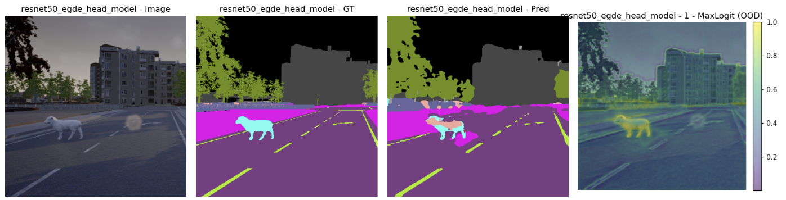

# Machine Learning for Computer Vision Assignment
University of Bologna, A.Y. 2024–2025.\
jana.nikolovska@studio.unibo.it

Link to [Github Repo](https://github.com/jananikolovska/semantic_segmentation_open_world)

---
## Semantic segmentation of unexpected objects on roads
---

### Notebook Execution and Dataset Storage

This notebook was executed using Google Colab. All datasets were stored on my Google Drive, with the following names: `train`, `validation`, and `test`. If they are saved elsewhere the variable `DATA_PATH` needs to be updated. The entire workflow is contained within a single notebook file. There is a flag, `TRAIN_ON`, which allows you to choose whether to train a new model or use preselected weights. The pretrained models are stored in the `MODEL_PATH` directory, together with their training logs and history, which I used to plot loss curves and guide design decisions. When `TRAIN_ON=False`, these training plots are not shown, since no new training occurs. If `TRAIN_ON=True`, the notebook trains the model, saves the best weights, and stores all result visualizations in the `SAVE_DIR` folder.Because full execution was too slow in Colab, the datasets were reduced in number of images to keep the workflow manageable with the resources and hours I had.

### Development Process and Experimental Design

During development, I experimented with various learning rates, different backbones (ResNet50 and ResNet101), and the inclusion or exclusion of an auxiliary edge head. A major challenge was handling uncertainty around object edges, so many design decisions specifically targeted this issue. The approach taken was based on my own ideas and experimentation, rather than following any specific published papers.

All ideas and parameter tunings were initially tested on a smaller dataset. The results from these experiments are not included as they are not directly comparable to the final results, since they were not trained on the same amount of data. To keep the notebook clear and easy to follow seven models were chosen for comparison, highlighting the design choice that had the most significant impact. 

During evaluation, some model predictions were automatically visualized and saved to the directory specified by `SAVE_DIR`. These saved visualizations were used extensively throughout the analysis phase to compare models qualitatively and to support the conclusions presented in the report. As a summary and direct comparsion fo an image, for each model in the notebook I generated side-by-side panels showing the input image, predicted segmentation, ground truth mask, and—when applicable—the OOD (open-set) heatmap. 

👋

